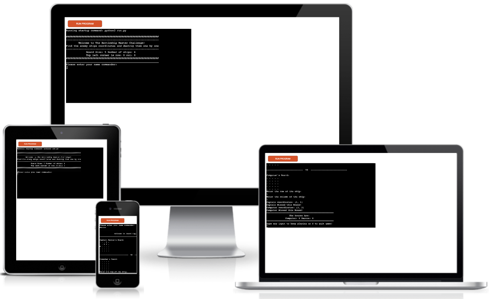
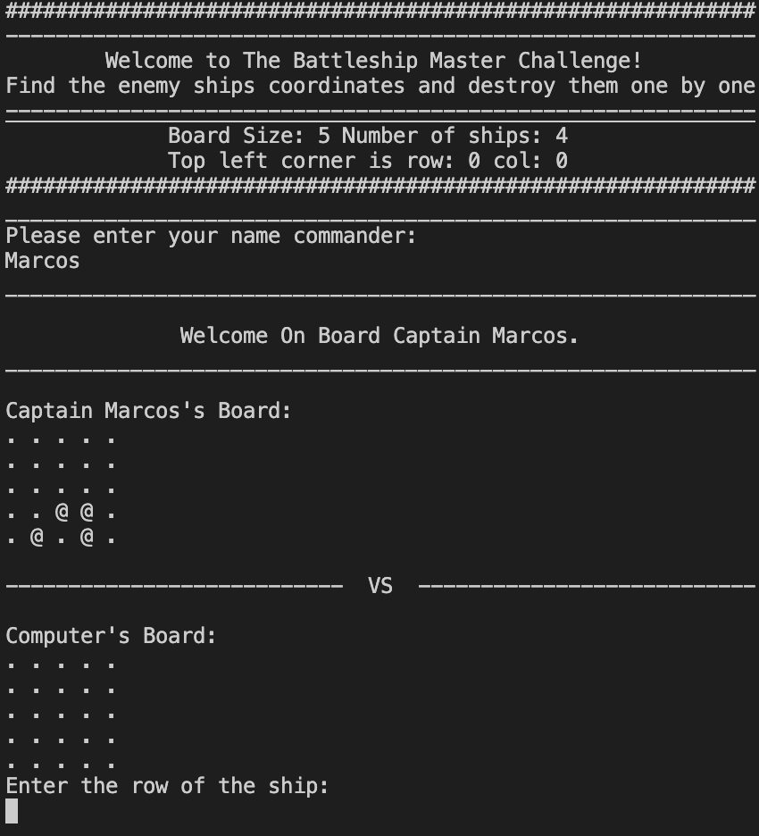
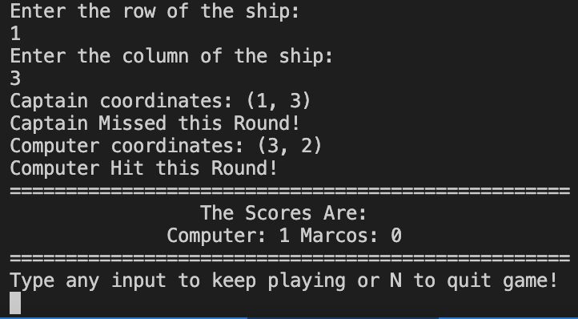
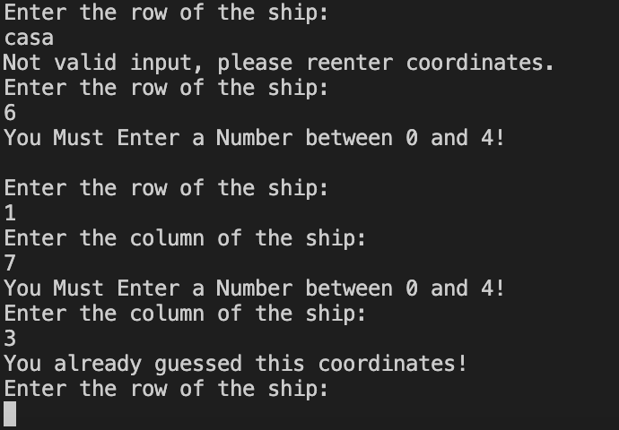

# The Battleship Master Challenge!

Here is Live version of the game: 
[The Battleship Master Challenge](https://pep8ci.herokuapp.com/)

This Battleship board game is the classic game of naval combat that brings together competition, strategy and excitement! In head-to-head battle, two players search for the enemy's fleet of ships and destroys them one by one.

## How to Play

The gameplay is straightforward. Each board place ships randomly in a vertical and horizontal space coordinates. Players take rounds calling out row and column coordinates on the computer's board in an attempt to identify a dot(.) that contains a ship. 

## Features

### Existing Features
- __Welcome Message__
  - Welcome message which gives the user an idea of how the game works.
  - User will be asked to enter their name which will display through out the game.
  

- __Random Board Generation__
  - Ships are populated randomly on each board instance.
  - Ships on computer's board are hide from players view.
  - Player's board display ships with @ sing.
  

- __Score Incrementation__
  - Scores are updated every round played.
- __Play Against The Computer__
  - Computer algorithm challenge
- __Prompt user's input__
  - Welcome user input
- __Missing a ship__
  - Results in "X" added to the coordinates guessed.
- __Hitting a ship__
  - Results in "*" added to the coordinates guessed.

- __Input Validation__
  - You Must Enter a Number between 0 and 4
  - You already guessed this coordinates
  - Not valid input, please reenter coordinates.

- __Data sustain in class instances__

### Features Left To Implement
- __Game Over Screen__
- __Victory Screen__
- __Allowing the player to choose board size, ships and place them on the board__
- __Hidding boards revelation after the game is over__
- __Allow larger ships on the boards__

## Data Model
I inspire my data model on the battleship prototype project, I changed the code to use a method inside the class for input validation instead of a function to validate the data as it was presented on the project prototype.

The GameBoard class contains number of ships, boards size, coordinates guessed, ships coordinates, name and type of instance.

The game generates two class intances one for the player e another for the computer, both instaces boards are randomly populated with ships.

GameBoard class has 4 methods to help run the game, the print_board method to print out the current board state, a guess method to return the result of each guess made, a get_user_input method to prompt user input and return a valid data and an add_ships method to add ships to the boards instances.

## Testing 

This game has been put through testing since the beginning and at every stage of the building through terminal, I made use of [CI Python Linter](https://pep8ci.herokuapp.com/) I had some errors, most of them were whitespaces, and some were variables that were not in use. But over all I was able to fix most of them only few "PROBLEMS" left which they are nothing to worrie about. 

During the building process, an error encountered was due to the function used to generate a random number for the computer's choice. I had subtract -1 to match the index to fix this error.

### Unfixed Bugs

No Unfixed Bugs left behind ;)

### Deployment

This project was deployed using Code Institute's mock terminal for Heroku.

1. Create a new Heroku app on the Heroku website.
2. Set config vars: Port and give it a value of 8000.
3. Set buildpacks to Python and NodeJS in that order.
4. Link the Heroku app to the repository on GitHub.
5. Click on Deploy.
